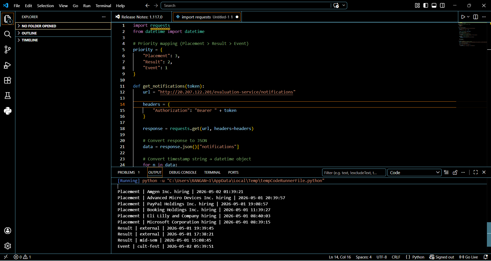

## Stage 1

This system is used to manage notifications for students like placement updates, results, and events.

The main things it should support are:

* Getting notifications for a student
* Creating a new notification
* Marking a notification as read

### APIs

To get notifications:
GET /notifications/{studentId}
This will return all notifications of a student.

To create a notification:
POST /notifications
Used to send a new notification to a student.

To mark as read:
PUT /notifications/{id}
This updates the notification as read.

For real-time updates, we can use WebSockets so users receive notifications instantly without refreshing.

---

## Stage 2

I would use MySQL because the data is structured and easy to manage.

Table: notifications
Fields:

* id
* studentId
* message
* type (Placement / Result / Event)
* isRead
* createdAt

### Problems

As the data grows, queries may become slow.

### Solutions

* Add indexes on important columns
* Use pagination to limit data
* Archive old data if needed

---

## Stage 3

The given query is correct but becomes slow when the table is large.

Reason:

* It scans too many rows without index

Solution:
Add a composite index on:
(studentId, isRead, createdAt)

This improves performance significantly.

Time complexity:

* Without index → O(n)
* With index → O(log n)

Adding index on every column is not good because it increases storage and slows inserts.

### Query

To find students who got placement notifications in last 7 days:

SELECT DISTINCT studentId
FROM notifications
WHERE type = 'Placement'
AND createdAt >= NOW() - INTERVAL 7 DAY;

---

## Stage 4

Currently notifications are fetched on every page load, which puts heavy load on the database.

### Improvements

* Caching → faster responses (but data may be slightly outdated)
* Pagination → load only limited data
* Lazy loading → load when needed
* WebSockets → push notifications instead of repeated fetching

---

## Stage 5

The given approach has some issues:

* It processes one by one (slow)
* No retry if email fails
* Not scalable

### Better Approach

Use a queue system.

Flow:

* Save notification in DB
* Add task to queue
* Worker processes tasks

Pseudo code:

function notify_all(student_ids, message):
for student_id in student_ids:
save_to_db(student_id, message)
add_to_queue(student_id, message)

worker():
while true:
task = get_task()
try:
send_email(task)
except:
retry(task)

This makes the system faster and more reliable.

---

## Stage 6

Here, notifications are prioritized.

Priority:

* Placement → highest
* Result → medium
* Event → lowest

Notifications are sorted based on:

1. Priority
2. Latest time

Finally, only top 10 notifications are shown so that users see the most important updates first.

## Output Screenshot

